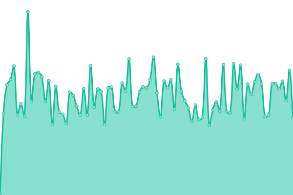
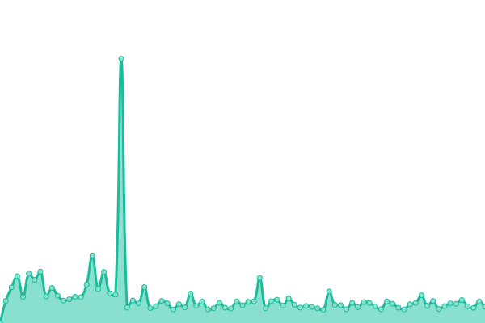
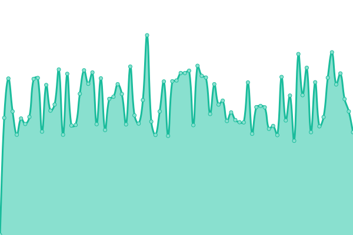
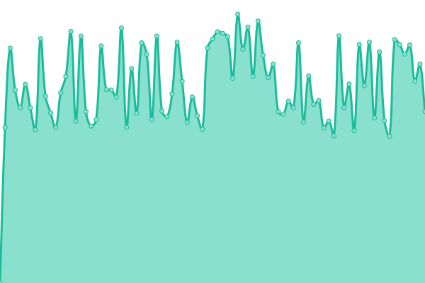

# [📈 Live Status](https://amsterdam.github.io/ee-upptime/): <!--live status--> **🟧 Partial outage**

This repository contains the open-source uptime monitor and status page for Gemeente Amsterdam Applicaties, powered by [Upptime](https://github.com/upptime/upptime).

With [Upptime](https://upptime.js.org), you can get your own unlimited and free uptime monitor and status page, powered entirely by a GitHub repository. We use [Issues](https://github.com/upptime/upptime/issues) as incident reports, [Actions](https://github.com/amsterdam/amsterdam-ee-upptime/actions) as uptime monitors, and [Pages](https://demo.upptime.js.org) for the status page.

<!--start: status pages-->
<!-- This summary is generated by Upptime (https://github.com/upptime/upptime) -->
<!-- Do not edit this manually, your changes will be overwritten -->
<!-- prettier-ignore -->
| URL | Status | History | Response Time | Uptime |
| --- | ------ | ------- | ------------- | ------ |
|  [Mijn Amsterdam](https://mijn.amsterdam.nl) | 🟥 Down | [mijn-amsterdam.yml](https://github.com/Amsterdam/ee-upptime/commits/HEAD/history/mijn-amsterdam.yml) | 

 0ms
     
 | 

<a href="https://amsterdam.github.io/ee-upptime/history/mijn-amsterdam">0.00%</a>
    

|  Developers Amsterdam | 🟩 Up | [developers-amsterdam.yml](https://github.com/Amsterdam/ee-upptime/commits/HEAD/history/developers-amsterdam.yml) | 

 515ms
     
 | 

<a href="https://amsterdam.github.io/ee-upptime/history/developers-amsterdam">100.00%</a>
    

|  Data Amsterdam | 🟩 Up | [data-amsterdam.yml](https://github.com/Amsterdam/ee-upptime/commits/HEAD/history/data-amsterdam.yml) | 

 547ms
     
 | 

<a href="https://amsterdam.github.io/ee-upptime/history/data-amsterdam">100.00%</a>
    

|  Bomen Amterdam | 🟩 Up | [bomen-amterdam.yml](https://github.com/Amsterdam/ee-upptime/commits/HEAD/history/bomen-amterdam.yml) | 

 3583ms
     
 | 

<a href="https://amsterdam.github.io/ee-upptime/history/bomen-amterdam">34.31%</a>
    

|  Omslag route Amsterdam | 🟩 Up | [omslag-route-amsterdam.yml](https://github.com/Amsterdam/ee-upptime/commits/HEAD/history/omslag-route-amsterdam.yml) | 

 1799ms
     
 | 

<a href="https://amsterdam.github.io/ee-upptime/history/omslag-route-amsterdam">99.74%</a>
    

|  Amsterdam Maps | 🟩 Up | [amsterdam-maps.yml](https://github.com/Amsterdam/ee-upptime/commits/HEAD/history/amsterdam-maps.yml) | 

 668ms
     
 | 

<a href="https://amsterdam.github.io/ee-upptime/history/amsterdam-maps">100.00%</a>
    

|  Meldingen Amsterdam | 🟩 Up | [meldingen-amsterdam.yml](https://github.com/Amsterdam/ee-upptime/commits/HEAD/history/meldingen-amsterdam.yml) | 

 645ms
     
 | 

<a href="https://amsterdam.github.io/ee-upptime/history/meldingen-amsterdam">100.00%</a>
    

|  Amsterdam Design System | 🟩 Up | [amsterdam-design-system.yml](https://github.com/Amsterdam/ee-upptime/commits/HEAD/history/amsterdam-design-system.yml) | 

 456ms
     
 | 

<a href="https://amsterdam.github.io/ee-upptime/history/amsterdam-design-system">99.15%</a>
    

|  AIP Amsterdam | 🟩 Up | [aip-amsterdam.yml](https://github.com/Amsterdam/ee-upptime/commits/HEAD/history/aip-amsterdam.yml) | 

 485ms
     
 | 

<a href="https://amsterdam.github.io/ee-upptime/history/aip-amsterdam">99.85%</a>
    

|  Amsterdam Sensoren | 🟩 Up | [amsterdam-sensoren.yml](https://github.com/Amsterdam/ee-upptime/commits/HEAD/history/amsterdam-sensoren.yml) | 

 436ms
     
 | 

<a href="https://amsterdam.github.io/ee-upptime/history/amsterdam-sensoren">100.00%</a>
    

|  Amsterdam Open Stad | 🟩 Up | [amsterdam-open-stad.yml](https://github.com/Amsterdam/ee-upptime/commits/HEAD/history/amsterdam-open-stad.yml) | 

 1711ms
     
 | 

<a href="https://amsterdam.github.io/ee-upptime/history/amsterdam-open-stad">100.00%</a>
    

|  Amsterdam Hior | 🟩 Up | [amsterdam-hior.yml](https://github.com/Amsterdam/ee-upptime/commits/HEAD/history/amsterdam-hior.yml) | 

 497ms
     
 | 

<a href="https://amsterdam.github.io/ee-upptime/history/amsterdam-hior">100.00%</a>
    

|  Bereikbaarheid Amsterdam | 🟩 Up | [bereikbaarheid-amsterdam.yml](https://github.com/Amsterdam/ee-upptime/commits/HEAD/history/bereikbaarheid-amsterdam.yml) | 

 486ms
     
 | 

<a href="https://amsterdam.github.io/ee-upptime/history/bereikbaarheid-amsterdam">100.00%</a>
    

<!--end: status pages-->

[**Visit our status website →**](https://amsterdam.github.io/ee-upptime)

## 📄 License

- Powered by: [Upptime](https://github.com/upptime/upptime)
- Code: [MIT](./LICENSE) © [Anand Chowdhary](https://anandchowdhary.com), supported by [Pabio](https://pabio.com)
- Data in the `./history` directory: [Open Database License](https://opendatacommons.org/licenses/odbl/1-0/)
